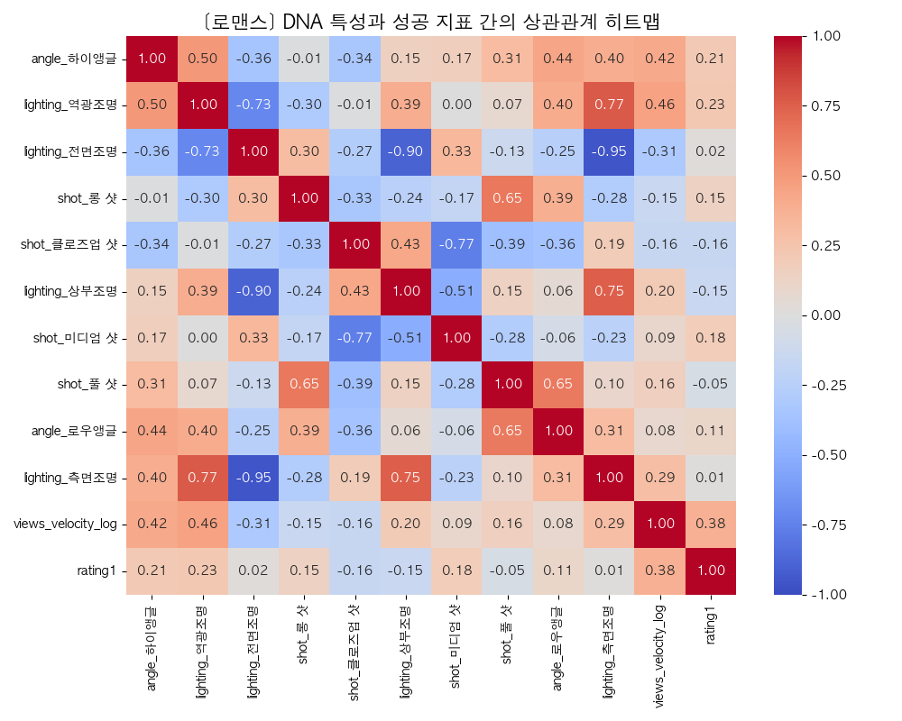
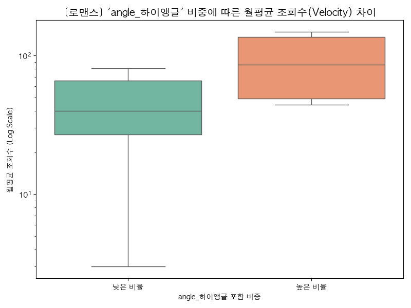
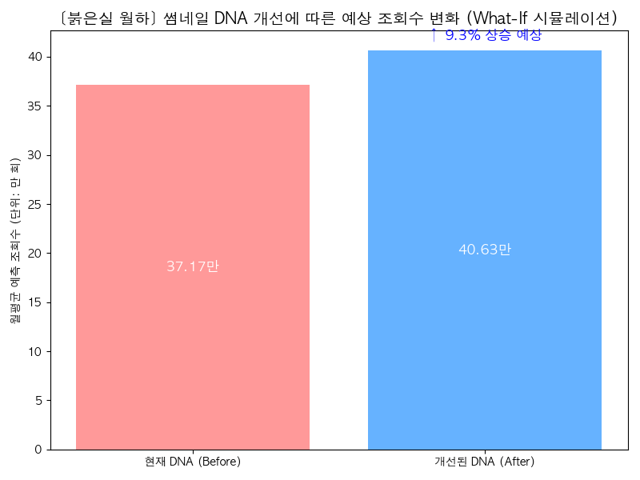

# 🖼️Webtoon Growth Analytics: 흥행 DNA 발굴 & 성과 예측 모델

본 프로젝트는 데이터 기반 의사결정을 수행하는 **콘텐츠 그로스 마케터**를 위한 데이터 분석 및 머신러닝(ML) 시뮬레이터 포트폴리오입니다.
웹툰의 '정성적인 작화 요소(조명, 샷, 앵글)'를 정량적인 'DNA 데이터'로 치환하여, 어떤 시각적 특징이 흥행(조회수)을 견인하는지 인과성을 검증하고, 나아가 썸네일을 개선했을 때의 성과 변화를 예측하는 **"What-If 시뮬레이터"**를 구축했습니다.

---

## 1. 📝 기획 의도 및 문제 정의 (Background & Objective)

*   **문제 정의 (Why?)**: 콘텐츠 시장에서 '작화와 썸네일'은 독자의 첫 클릭을 유도하는 최전선 매체입니다. 하지만 기존의 평가는 "그림체가 예쁘다, 화려하다"와 같은 **'정성적이고 주관적인 감'**에 의존하고 있었습니다.
*   **기획 의도 (Objective)**: 감의 영역에 있던 작화를 **데이터 기반의 정량적 지표(DNA)**로 구조화하여, "어떤 시각적 특징이 실제 클릭률(관심도)과 조회수(리텐션)를 견인하는가?"를 통계적으로 검증합니다.
*   **가설 (Hypothesis)**: 특정 장르(예: 로맨스)에서 유저의 시각적 피로도를 낮추고 감정선을 극대화하는 특정 DNA(예: 역광 조명, 아이레벨 앵글 등)의 활용 비율이 높을수록, 해당 작품의 '월평균 누적 조회수'가 통계적으로 유의미하게 높을 것이다.

---

## 2. 🗄️ 데이터 수집 및 엔지니어링 파이프라인 (Data Pipeline)

### 1) Raw Data (JSON) → 메타데이터 테이블 정제
- **Source**: AI-HUB 만화웹툰 생성 데이터 (총 53,525개 이미지 라벨링 샘플)
- 웹툰 이미지 1컷마다 부여된 JSON 형태의 어노테이션 데이터(`{"lighting": "역광조명", "shot": "클로즈업 샷", ... }`)를 Python 전처리 파이프라인을 통해 파싱했습니다.
- 이를 타이틀(Title) 단위로 그룹화하여, **"해당 타이틀에서 특정 DNA 요소가 평균적으로 활용된 비율(Proportion)"** 형태의 연속형 변수(`webtoon_master_data.csv`)로 압축했습니다.

### 2) 서비스 지표 결합 및 타겟 지표 '정규화(Normalization)'
- 플랫폼 누적 조회수를 종속 변수로 바로 사용하면, 연재 기간(1년 차 vs 10년 차 작품)에 따른 심각한 스케일 왜곡이 발생합니다.
- 이를 보정하기 위해 총 연재 개월 수를 계산하여 타겟 지표를 **`월평균 연재 조회수(Velocity)`**로 새롭게 생성(정규화)하여 분석의 객관성을 확보했습니다.

---

## 3. 🔬 가설 검증: 다중 회귀 분석 및 상관관계 (Analysis)

가장 샘플 수가 많은 메인 장르('로맨스')를 대상으로, 정규화된 타겟 지표(월평균 조회수)와 DNA 요소 간의 다중 회귀 분석(Multiple Regression)을 수행했습니다.

### [분석 결과 1] 변수 간 상관관계 점검 (Seaborn Heatmap)
**인사이트**: 다양한 DNA 변수 중, 성공 지표와 두드러지는 상관성을 보이는 요소들을 1차적으로 필터링하고 다중공선성을 점검했습니다.


### [분석 결과 2] 핵심 흥행 DNA 검증 (Seaborn Boxplot)
**인사이트**: 회귀 모델에서 조회수를 가장 강력하게 견인할 것으로 예측된 **'역광 조명'** 특성에 대해 Boxplot 검증을 수행했습니다. 역광 조명 씬을 상위 수준으로 활용한 작품군의 '상위 75% 월평균 조회수 구간'이 낮은 그룹 대비 압도적으로 높게 형성되어, 작화 연출의 차이가 유의미한 트래픽 차이로 이어짐을 직관적으로 확인했습니다.


---

## 4. 🚀 그로스 액션: 성과 예측 "What-If 시뮬레이터" (Predictive Modeling)

회귀 분석을 통한 현상 파악에 그치지 않고, 그로스 마케터가 런칭 전/초기 단계의 실무 의사결정에 즉각적으로 활용할 수 있는 **머신러닝(Random Forest) 예측 시뮬레이터**를 파이썬으로 직접 개발했습니다. (모델 설명력 R-Squared: 0.795)

### 📈 가상 시나리오 (A/B Test 기반 의사결정)
1.  **Target (문제 상황)**: 현재 조회수 지표가 부진한 로맨스 웹툰 A 선정 (모델의 최초 예측 월 조회수: 약 37만 회)
2.  **Action (실험 세팅)**: 앞선 회귀분석/Random Forest Feature Importance 분석을 통해 흥행 요인으로 밝혀진 **`#역광조명`**과 **`#아이레벨 앵글`** 비중을 시뮬레이터 상에서 강제 상향 반영.
3.  **Result (성과 예측)**: 변경된 썸네일 DNA 값을 시뮬레이터에 재입력하자, **월평균 예상 조회수가 40.6만 회로 `+9.3% 상승`**한다는 정량적인 그로스 액션 결과를 획득.

> **💡 [마케터 실무 적용 Point]**
> "PD님, 이 작품 1화 이탈률 방어를 위해 썸네일과 극 초반부 클라이맥스 컷의 명도 대비를 높이고 '역광 조명'을 사용해 봅시다. 저희 데이터 예측 모델에 따르면 이 작화 변경만으로 트래픽을 약 9% 방어할 수 있습니다." 와 같은 **데이터 기반 설득 커뮤니케이션**이 가능합니다.



---

## 💡 프로젝트 한계 및 발전 방향 (SWOT & Next Action)

데이터 분석과 실험을 주도하는 마케터로서 본 프로젝트의 맹점과 보완 가능한 다음 단계를 명확히 인지하고 있습니다.

*   **현재의 한계 (Weakness)**: 보유 데이터의 특성상 유저 단위의 세밀한 '클릭 스트림(CTR)'이나 특정 화차 단위의 '체류시간(Duration)' 등 실무 레벨의 직접적인 퍼널 행동 데이터가 부재하여, '최종 구매 전환율 입증'에는 도달하지 못했습니다.
*   **실무 투입 시 개선 방안 (Opportunity)**: 만약 네이버웹툰 사내 데이터하우스(DW/GA4) 접근 권한이 주어진다면, 제가 구축한 본 예측 모델(DNA 변수)에 **'일자별/에피소드별 유저 열람 로그(User Log)'**를 Join할 수 있습니다. 이를 통해 "썸네일 작화 변경에 따른 다음 화차 연속 열람(리텐션) 비율 변화"를 시계열 단위로 추적하는 완벽한 툴로 고도화할 수 있습니다.

### 🚀 [Next Action] 웹툰 DNA와 CRM 데이터 결합 기반의 초개인화 타겟팅
본 프로젝트에서 정의한 '웹툰 DNA(장르, 그림체, 연출)'를 실제 유저 행동 데이터(가입 시 선호 장르, 클릭 태그, 스크롤 속도 등)와 결합하여 **CRM 개인화 및 추천 모델**로 확장하는 것을 목표로 합니다.

*   **유저별 '콘텐츠 취향 프로필' 구축**: 단순히 '로맨스를 좋아하는 유저'가 아니라, 모델이 정량화한 DNA를 바탕으로 *'따뜻한 색감의 일상 로맨스를 선호하는 세그먼트'*와 *'강렬한 색대비의 판타지 로맨스를 선호하는 세그먼트'*로 세분화합니다.
*   **사용자 여정(User Journey) 기반 CRM 액션 전개**:
    *   **Day 1~2 (온보딩)**: 유저 취향 프로필과 일치하며, 5화 이후 반응이 급상승하는 작품을 인앱 배너 및 푸시 알림으로 추천합니다.
    *   **Day 3~5 (활성화)**: 즐겨찾기 미설정 유저 대상으로 혜택 안내 메시지를 발송합니다.
    *   **이탈 방지 (리텐션)**: 특정 화차(예: 3화)에서 정주행을 이탈한 유저에게 2~3일 후 '스토리가 본격 전개되는 하이라이트 장면'을 취향 톤앤매너에 맞춘 카피/이미지와 함께 푸시하여 재유입을 유도합니다.
*   **효과 검증 (A/B Test)**: CRM 액션 적용군/미적용군 분리 후, **코호트 분석**을 통해 주차별 리텐션 곡선을 비교하고, **클러스터링 방법론**을 통해 세그먼트별 행동 차이와 비즈니스 임팩트를 정량적으로 분석합니다.
*   **신작 프로모션 고도화**: 축적된 '유저 취향 프로필 × 작품 DNA' 매칭 데이터를 바탕으로, 신작 런칭 시 핵심 전환 타겟 세그먼트에 마케팅 예산과 프로모션을 집중하는 전략적 의사결정에 활용할 수 있습니다.

---

## 📁 Repository Structure
```text
├── data/               # Raw & Processed 데이터베이스 (Git-ignored)
├── docs/               # 포트폴리오 기획안, 데이터 명세서 및 노션 초안 문서
├── results/            # 모델링 평가, 시뮬레이션 메트릭 및 시각화 차트 (.png)
├── scripts/            # 데이터 전처리 및 분석, Random Forest 파이썬 스크립트 (.py)
└── README.md
```

## 📚 References
* **심채린, 이지혜 (2025).** *웹툰 썸네일의 시각적 요소 분류와 독자의 선호도에 관한 연구*
* **유은제 (2019).** *웹툰의 일러스트와 스토리 품질이 만족과 소장가치에 미치는 영향*
* **고은나 (2006).**  디지털 콘텐츠 산업과 디지털 만화에 관한 연구_
---
*Developed as a Growth Marketing Analytics Portfolio.*
